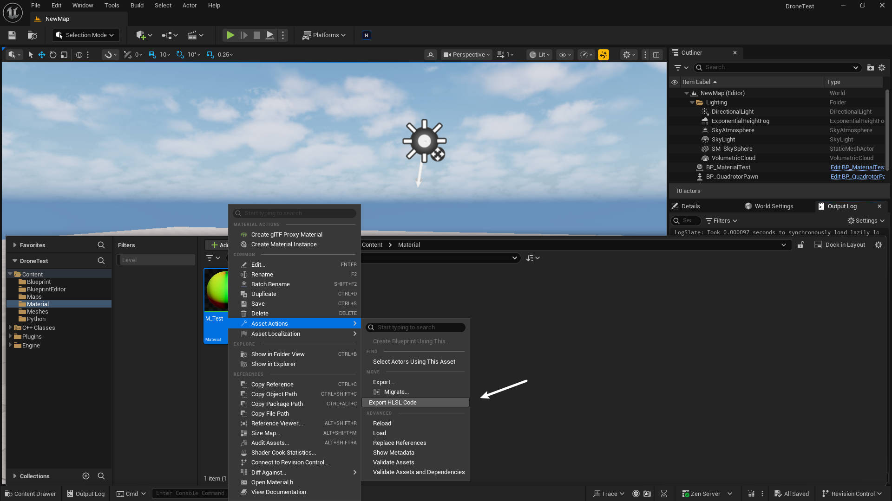
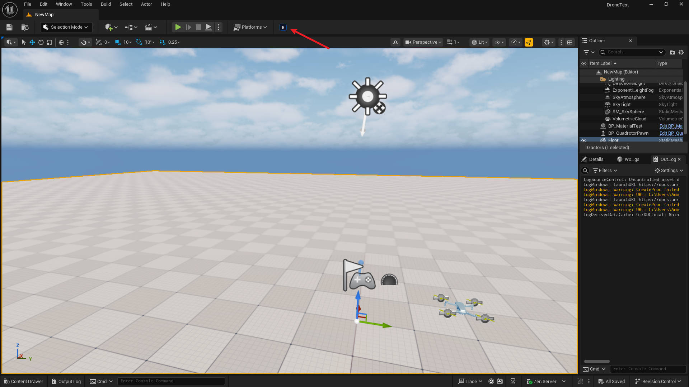
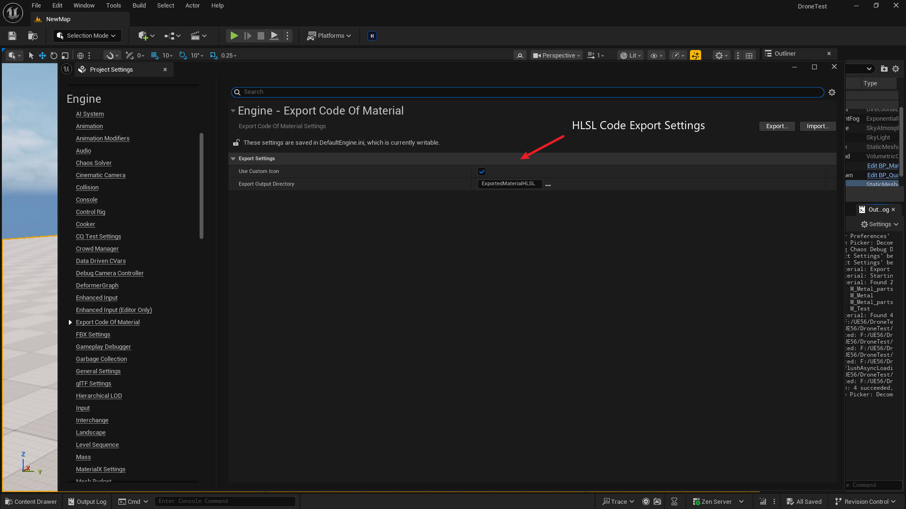
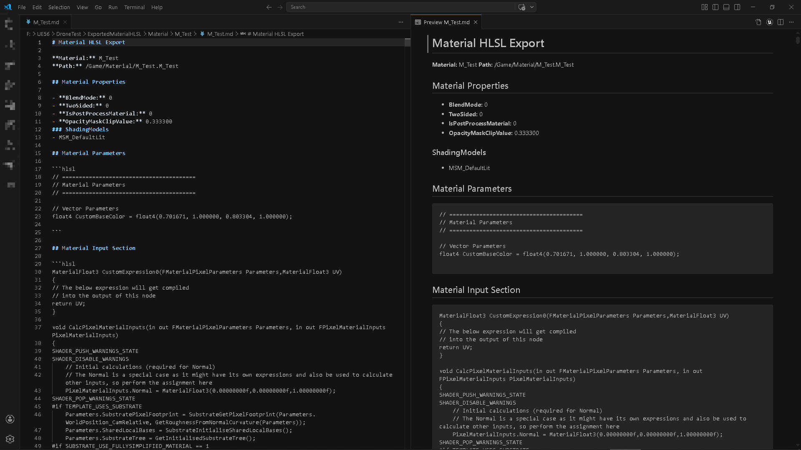

# ExportCodeOfMaterial

Export materials to HLSL shader code files for analysis and debugging.

## Overview

ExportCodeOfMaterial is an editor plugin that converts UE materials into readable HLSL code. It extracts material properties, shader parameters, and generated HLSL code into markdown files that can be reviewed, shared, or used for learning shader development.

## Installation

1. Open **Edit > Plugins** in Unreal Editor
2. Search for **Export Code Of Material**
3. Enable the plugin
4. Restart the editor

### Dependencies

- EditorScriptingUtilities (enabled by default)

## Usage

### Console Command

Open the console (~) and type:

```
ExportMaterialHLSL
```

This exports all materials under `/Game/` to the output folder.Default to Project/ExportedMaterialHLSL

### Export Selected Materials

1. Select one or more materials in the Content Browser
2. Right-click to open the context menu
3. Select **Export HLSL Code**



### Export All Materials

1. Open the Asset menu in the Content Browser
2. Select **Export Material HLSL**



## Configuration

Configure the plugin via **Project Settings**:

1. Go to **Project Settings > Export Code Of Material**
2. Set the **Export Output Directory** path



Default output folder: `ProjectDir/ExportedMaterialHLSL/`

## Output Format

Each export creates a `.md` file containing:

- **Material Properties**: Blend mode, shading models, two-sided, opacity mask
- **Material Parameters**: Scalar, vector, texture, and static switch parameters
- **Material Input Section**: Custom expression functions and input connections
- **Full HLSL Code**: Generated shader code



### Alternative HLSL Viewing Methods

If HLSL generation fails, try these alternatives:

**Method 1 - Material Editor**
- Open material in Material Editor
- Window > Shader Code > HLSL Code

**Method 2 - Console Command**
- Open Output Log console
- Type: `r.ShaderDevelopmentMode 1`
- Compile material
- Check: `ProjectDir/Saved/HLSLCode/`


## Target Users

### Who Can Be Benefits

- **Technical Artists** - Understand shader logic to communicate effectively with engineers
- **Shader Developers** - Analyze compiled shaders for performance optimization and debugging
- **Graphics Engineers** - Debug shader compilation issues and verify parameter usage
- **Technical Directors** - Review material standards across the project team
- **Artists Migrating from Other Engines** - Learn HLSL by studying UE material implementations

### Use Cases

| User | Use Case |
|------|---------|
| Technical Artist | "Why is my material not responding to light?" - Check shading model settings |
| Shader Developer | "Is this texture sampled only once?" - Review generated HLSL |
| Graphics Engineer | "Shader compilation failed" - Extract input section for debugging |
| Technical Director | Enforce material standards - Batch export all materials for review |

## Technical Details

- **Supported Materials**: Material, Material Instance
- **Output Format**: Markdown (.md)
- **Platform Support**: Win64; The plugin should work for Mac, Linux but do not test. 
- **Engine Version**: UE 5.6+

## Support

For questions or issues:
- Email: 289663346@qq.com